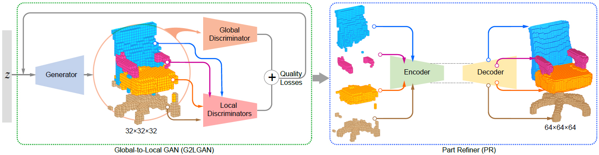

## Global-to-Local Generative Model for 3D Shapes

### Introduction

Three-dimensional content creation has been a central research area in computer graphics for decades. The main challenge is to minimize manual intervention, while still allowing the creation of a variety of plausible 3D objects.In this work, we present a global-to-local generative model to synthesize 3D man-made shapes.

Global-to-Local Generative Model for 3D Shapes consist of two networks: a **Global-to-Local GAN**(G2LGAN) and a **Part Refiner**(PR).

Specifically, using a generative adversarial network training, with global and local discriminators, out G2LGAN generates 3D semantically segmented models. The PR is based on an auto-encoder architecture and its goal is to refine the individual semantic parts output from G2LGAN.
For more details, please refer to our [paper](http://202.182.120.255/file/upload_file/image/research/att201810171620/G2L.pdf).



### Usage
The rest part of code will coming soon.

### License
Our code is released under MIT License (see LICENSE file for details).

### Citation

Please cite the paper in your publications if it helps your research:
```
@article{G2L18,
title = {Global-to-Local Generative Model for 3D Shapes},
author = {Hao Wang and Nadav Schor and Ruizhen Hu and Haibin Huang and Daniel Cohen-Or and Hui Huang},
journal = {ACM Transactions on Graphics (Proc. SIGGRAPH ASIA)},
volume = {37},
number = {6},
pages = {214:1—214:10},  
year = {2018},
} 
```
